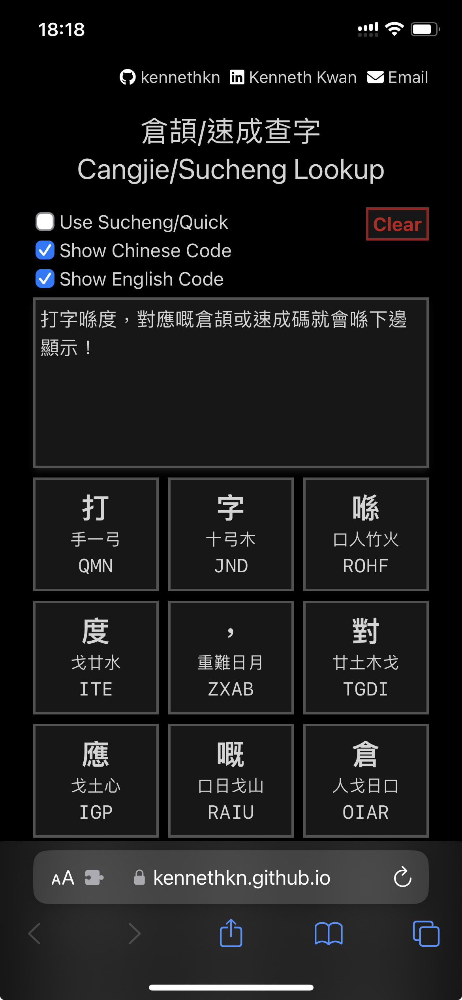
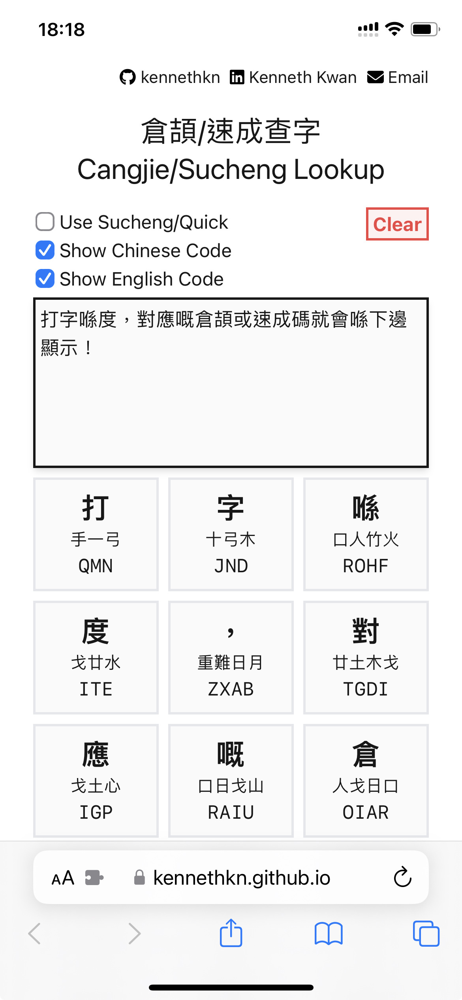

  
  <h3>
    <a href="https://kennethkn.github.io/cangjie-sucheng-lookup/">
      Cangjie/Sucheng Lookup (倉頡/速成查字)
    </a>
  </h3>
  

    Lookup Cangjie/Sucheng codes for Chinese characters and punctuations.
  

  
  

 

- Live conversions while typing
- Customizable output formats
- Clear input field with a single click (w/ 5sec undo)
- Elegant design with automatic light/dark mode
- No ads & open source

**Try it now :arrow_right: <https://kennethkn.github.io/cangjie-sucheng-lookup/>**

Feel free to contribute to this project by creating issues or pull requests.

If you find this project helpful, please consider giving it a star. :wink:
